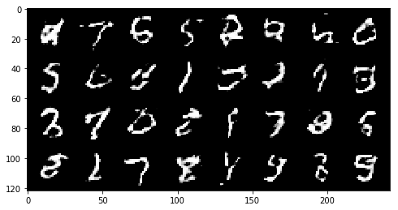
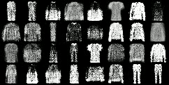
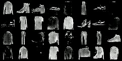

# NOTE: IF YOU HAVING TROUBLE OPENING JUPYTER NOTEBOOKS PLEASE OPEN THE FOLLOWING LINKS
<b>DCGAN</b> : https://nbviewer.jupyter.org/github/aryanshu/GAN-/blob/master/DCGAN.ipynb
 <b>GAN</b>   : https://nbviewer.jupyter.org/github/aryanshu/GAN-/blob/master/GAN.ipynb 

# Implementation of GANs and DCGANs using PyTorch
The Generative Adversarial Network and Deep Convolutional Generative Adversarial Networks implemented in this project was based on the paper "<a href="https://arxiv.org/abs/1406.2661">Generative Adversarial Networks<a>" by Goodfellow et al. and  "<a href="https://arxiv.org/abs/1511.06434">Unsupervised Representation Learning with Deep Convolutional Generative Adversarial Networks<a>" by Soumith Chintala Respectively.

Apart from DCGAN there are many extension have been introduced in the past 2 to 3 years related to GANs , still it is most attention seeker area in Computer Vision or Deep learning in general.   

## GANs:
General adversarial networks and It's family of adverserial Networks(including DCGANs) are two neural networks competing against each other to create an output that closely resembles the input. These two networks — the generator and the discriminator— are playing adversarial roles. The generator network creates a new image from random noise based off of the input image. The random noise evolves from incoherent pixels to a coherent image with discernible forms in it because of how the discriminator told it to change. The discriminator network determines if the image is real or fake. The goal of the GAN is for the generator image to be so like the real image that it is able to trick the discriminator into thinking that the generated image is real. One of the most important features of GANs, is that the neural networks implemented in GANs use a number of parameters significantly smaller than the amount data used to train them. This forces the model to learn and internalize the most important features in the data so the model can generate them.

## Architecture:

## DCGANs
It is an extension of GANs . It mainly composes of convolution layers without max pooling or fully connected layers. It uses convolutional stride and transposed convolution for the downsampling and the upsampling. The figure below is the network design for the generator.

## RESULTS

All results are generated from the fixed noise vector. 
<b> Results on MNIST digit dataset:</b> 
MNIST digit dataset is a large database of handwritten digits .There are about 6000 train image and 10000 test images. 

*Name* | *Time Taken* | *Epoch 1* | *Mid Epoch* | *Max Epoch* | *GIF*
:---: | :---: | :---: | :---: | :---: | :---: |
GAN | 12.35 mins |  |  |  | 
DCGAN | 34.6 mins  |  |  |  | 

<b>Results on Fashion MNIST dataset:</b> 
MNIST digit dataset is a large database of fashion clothing product , It contains 10 clothing cateogry porducts .There are about 60,000  images. 

*Name* | *Time Taken* | *Epoch 1* | *Mid Epoch* | *Max Epoch* | *GIF*
:---: | :---: | :---: | :---: | :---: | :---: |
GAN | 62.7 mins |  |  | | 
DCGAN | 64.9 mins |  |  |  | 

